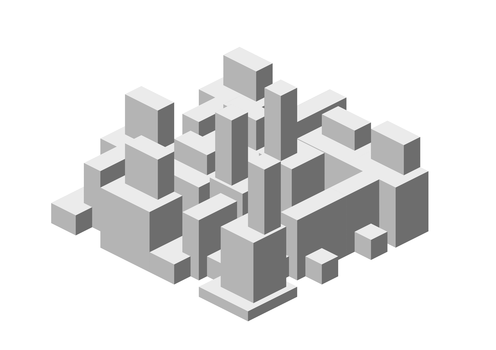
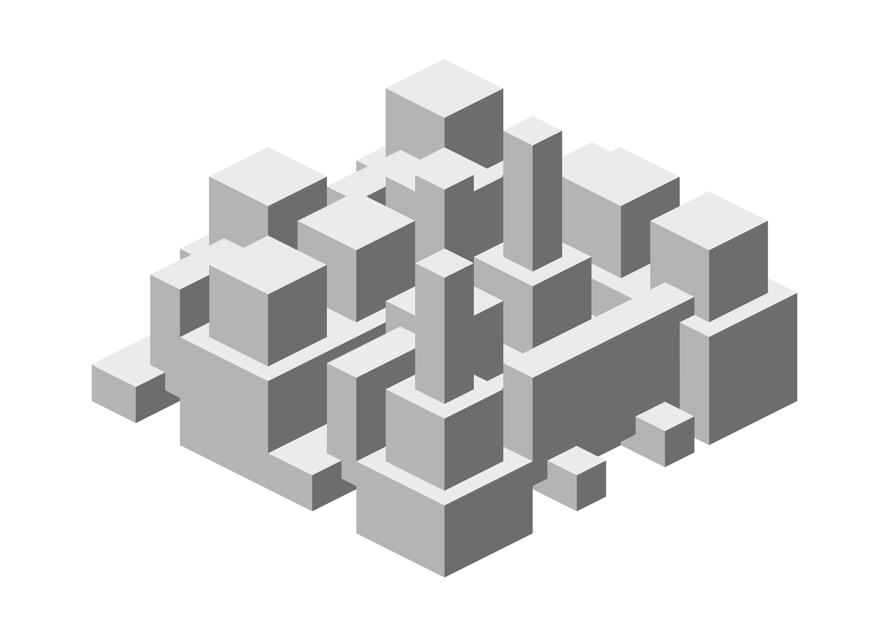

This JSON files is a custom render scheme with white background (derived from DeepOcean) to use to print cool images during the Malevitch Power Pack workshop.

On OS X, to use it in the editor preview:

- Place it in Applications/OpenSCAD/Contents/Resources/color-schemes/render/
 - Restart the app
 - Select it in the preferences

Or use it on the command line to generate higher resolution images like that :

cd /Users/myself/myopenscadproject
 
openscad -o mycity.png --imgsize=5940,4200 --colorscheme=Malevitch --camera=0,0,12,60,0,45,190 --projection=ortho malevitch-power-pack.scad 

If OpenSCAD is on your Applications folder on OS X, the command should be 

/Applications/OpenSCAD.app/Contents/MacOS/OpenSCAD -o mycity.png --imgsize=5940,4200 --colorscheme=Malevitch --camera=0,0,12,60,0,45,190 --projection=ortho malevitch-power-pack.scad 

Here is the result:

Here is a result from an older version of the code:

